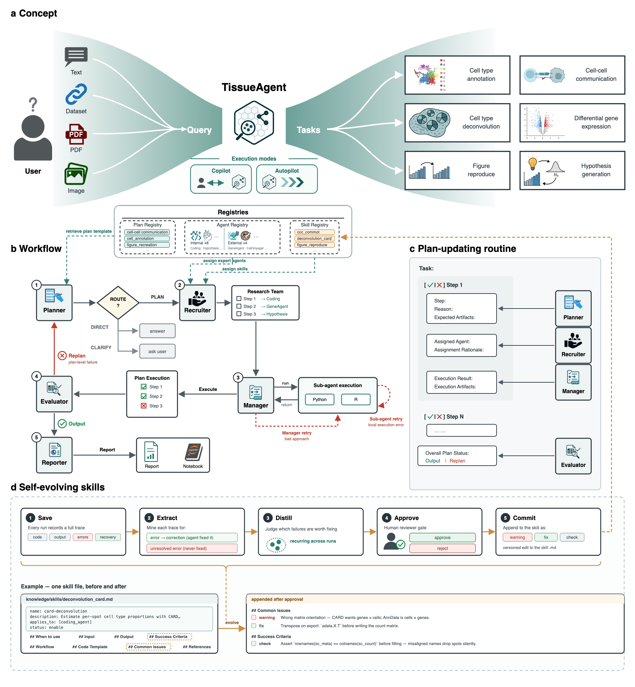

# TissueAgent: A Role-Based Multi-Agent Framework for Reproducible Spatial Transcriptomics Workflows

## Project Overview

TissueAgent is a role-based multi-agent framework that turns open-ended natural-language ST requests and multimodal inputs (data, PDFs, images) into auditable, runnable workflows. A single evolving plan coordinates specialized agents and records rationales, step status, and artifact links, enabling transparent provenance and targeted replanning. By separating planning, recruitment, execution, evaluation, and reporting, TISSUEAGENT is designed to improve reliability across heterogeneous, multi-stage analyses.

## Key Features

- Role-based multi-agent design with explicit separation of planning, recruitment, execution, evaluation, and reporting.
- A single evolving plan that tracks rationales, step status, and artifact links to support transparent provenance and targeted replanning.
- Built-in collaboration with external specialized agents to extend capabilities for domain-specific tasks.
- Support for diverse spatial transcriptomics workflows such as figure reproduction, cell type annotation, cell-cell communication, differential gene expression, and cell type deconvolution.



## Execution modes

TissueAgent runs in one of two modes, controlled by a toggle in the web UI's sidebar:

- **Autopilot** *(default)* — the planner, recruiter, manager, evaluator, and reporter run end-to-end without pausing. This is the only mode available outside the web UI (notebook and CLI entry points always run autopilot).
- **Copilot** — the run pauses after the planner finishes drafting the plan, and again after the recruiter assigns agents. At each pause the plan panel surfaces four actions:
  - **Approve** to accept and continue,
  - **Edit** to modify the plan markdown (or change per-step agent assignments) and resume,
  - **Send feedback** to give free-text guidance that rewinds the run back to the planner,
  - **Cancel run** to abort and start fresh.

Mode is persisted with the session and survives reloads. Switching modes mid-run is blocked — finish or cancel the current run first.

## Project Structure

```text
TissueAgent/
├── src/                                 # application source
│   ├── agents/
│   │   ├── planner_agent/
│   │   ├── recruiter_agent/
│   │   ├── manager_agent/
│   │   ├── evaluator_agent/
│   │   ├── reporter_agent/
│   │   ├── agent_registry/              # domain/specialised agents and tools
│   │   └── agent_tools.py               # shared file-access tools (glob/grep/read/write)
│   ├── graph/                           # LangGraph workflow + state orchestration
│   ├── server/                          # FastAPI backend, WebSocket, REST routes
│   ├── frontend/                        # React + TypeScript frontend
│   └── config.py                        # path constants & runtime settings
├── knowledge/                           # prompt-time source material (importable as a package)
│   ├── plans/                           # planner template library (.md)
│   ├── skills/                          # agent skill snippets (.md)
│   └── docs/                            # API docs the coding agent retrieves from
├── workspace/                           # runtime data root (== DATA_DIR in code)
│   ├── library/                         # persistent shared input — UI section "Library"
│   │   ├── datasets/                    #   curated reference datasets
│   │   └── files/                       #   persistent reference uploads (PDFs, notes, …)
│   ├── projects/                        # one folder per project — UI section "Projects"
│   │   └── <project_id>/                #   id = timestamp (e.g. 2026-06-07_19-42-10)
│   │       ├── chat.json                #     saved conversation (drives the project list)
│   │       ├── uploads/                 #     everything the user uploads for this run (sidebar files, images, PDFs)
│   │       └── outputs/                 #     agent's working directory (kernel cwd)
│   ├── scratch/                         # pre-project draft (wiped on reset / new project)
│   │   └── uploads/                     #   surfaced in UI as "Project files — Unsaved"; migrated into projects/<id>/ on first prompt
│   ├── plan_scratch/                    # ephemeral plan markdown (in-flight only)
│   └── notebook/                        # process-wide notebook scratch
├── demo/                                # notebooks, sample inputs, expected outputs
├── docs/figures/                        # README/manuscript figures
├── notebooks/                           # exploratory notebooks
├── logs/                                # runtime logs
├── sessions/                            # LEGACY pre-refactor saves (migrated to workspace/projects/ on boot)
├── pyproject.toml                       # Python project configuration
├── environment.yml                      # Conda environment definition
└── flake.nix                            # Nix development environment
```

### Runtime data layout (`workspace/`)

| What you see in the UI | On-disk path | Persistence |
| --- | --- | --- |
| **Library → Datasets** | `workspace/library/datasets/` | persistent; shared across all projects |
| **Library → Files** | `workspace/library/files/` | persistent; shared across all projects |
| **Project files → uploads/** | `workspace/projects/<id>/uploads/` | tied to the project; holds every user upload (sidebar files, chat images, PDFs) |
| **Project files → outputs/** | `workspace/projects/<id>/outputs/` | tied to the project; kernel cwd during a run |
| Project list (sidebar) | `workspace/projects/*/chat.json` | one row per saved project |
| "Unsaved" draft (no project yet) | `workspace/scratch/uploads/` | wiped on every server boot AND on new project |

Two roots that the agent treats differently:

- **`library/` is read-only to agents.** Agents `read` from it freely, but `write_*` tools refuse paths inside `library/` — the library is the user's curated reference corpus, not a dumping ground for intermediates.
- **`projects/<active>/outputs/` is the agent's working directory.** Relative writes from the `write` tool, kernel-side `os.chdir`, and `jupyternb_generator_tool` all anchor here, so generated artifacts surface in the Files panel automatically.

## Repository set-up

1. Clone the repository **with submodules** and `cd` into the local directory
   ```bash
   git clone --recurse-submodules https://github.com/ma-compbio/TissueAgent
   cd TissueAgent
   ```
   If you already cloned without `--recurse-submodules`, initialize them manually:
   ```bash
   git submodule update --init --recursive
   ```

2. Set up your LLM credentials. See [LLM credentials](#llm-credentials) below for the full list of supported providers and models. At minimum, one provider key is required — by default that's `OPENAI_API_KEY`:
   ```bash
   export OPENAI_API_KEY="sk-..."
   export ANTHROPIC_API_KEY="sk-ant-..."     # optional, for Claude models
   export OPENROUTER_API_KEY="sk-or-..."     # optional, for OpenRouter
   ```
   You can also paste keys directly into the web UI (sidebar → **API keys**); UI values override env vars and stay in server memory until cleared.

### Option A1: Using conda

1. [Install Miniconda](https://docs.anaconda.com/miniconda/) or [Anaconda](https://www.anaconda.com/download) if you haven't already.

2. Create the conda environment and install dependencies:
   ```bash
   conda env create -f environment.yml
   conda activate tissueagent
   pip install -e .       # installs Python deps from pyproject.toml
   cd src/frontend
   npm install            # installs React/TypeScript deps
   cd ../..
   ```

3. Start the application (two terminals, both with `conda activate tissueagent`):
   ```bash
   # Terminal 1 — FastAPI backend
   PYTHONPATH=$(pwd)/src uvicorn server.main:app --reload --reload-dir src --host 0.0.0.0 --port 8000

   # Terminal 2 — React dev server (hot-reload)
   cd src/frontend
   npm run dev
   ```

4. Open **http://localhost:5173** in a web browser. The React dev server proxies API and WebSocket requests to the FastAPI backend automatically.

#### Production mode (single process)

```bash
conda activate tissueagent
cd src/frontend && npm run build && cd ../.
PYTHONPATH=$(pwd)/src uvicorn server.main:app --host 0.0.0.0 --port 8000
```
Open **http://localhost:8000**. FastAPI serves the built React app as static files.

### Option A2: Using uv

You will need to install the following manually:
- **Python 3.12** — [python.org](https://www.python.org/downloads/) or your system package manager
- **uv** — [docs.astral.sh/uv](https://docs.astral.sh/uv/)
- **Node.js 22+** and **npm** — [nodejs.org](https://nodejs.org/)

1. Install dependencies:
   ```bash
   uv sync              # creates .venv and installs Python deps
   cd src/frontend
   npm install           # installs React/TypeScript deps
   cd ../..
   ```

2. Start the application (two terminals):
   ```bash
   # Terminal 1 — FastAPI backend
   source .venv/bin/activate
   PYTHONPATH=$(pwd)/src uvicorn server.main:app --reload --host 0.0.0.0 --reload-dir src --port 8000

   # Terminal 2 — React dev server (hot-reload)
   cd src/frontend
   npm run dev
   ```

3. Open **http://localhost:5173** in a web browser.

#### Production mode (single process)

```bash
source .venv/bin/activate
cd src/frontend && npm run build && cd ../..
PYTHONPATH=$(pwd)/src uvicorn server.main:app --host 0.0.0.0 --port 8000
```
Open **http://localhost:8000**.

### Option B: Using Nix

A Nix flake is provided that supplies Python 3.12, uv, Node.js 22, and npm.

1. [Install Nix](https://nixos.org/download) if you haven't already.

2. Enter the dev shell and install dependencies:
   ```bash
   nix develop          # drops you into a shell with python, uv, node, npm
   uv sync              # creates .venv and installs Python deps
   cd src/frontend
   npm install          # installs React/TypeScript deps
   cd ../..
   ```

3. Start the application (two terminals, both inside `nix develop`):
   ```bash
   # Terminal 1 — FastAPI backend
   source .venv/bin/activate
   PYTHONPATH=$(pwd)/src uvicorn server.main:app --reload --reload-dir src --host 0.0.0.0 --port 8000

   # Terminal 2 — React dev server (hot-reload)
   cd src/frontend
   npm run dev
   ```

4. Open **http://localhost:5173** in a web browser. The React dev server proxies API and WebSocket requests to the FastAPI backend automatically.

#### Production mode (single process)

```bash
nix develop
source .venv/bin/activate
cd src/frontend && npm run build && cd ../..
PYTHONPATH=$(pwd)/src uvicorn server.main:app --host 0.0.0.0 --port 8000
```
Open **http://localhost:8000**. FastAPI serves the built React app as static files.

### Option C: Headless Mode

No frontend is needed. Install Python dependencies using either conda or uv, then run TissueAgent directly from a Jupyter notebook.

**Using conda:**
```bash
conda env create -f environment.yml
conda activate tissueagent
pip install -e .
```

**Using uv:**
```bash
uv sync
```

See `demo/` for examples on how to invoke TissueAgent from a notebook.

#### CLI

TissueAgent ships a command-line entry point that runs the full
planner → recruiter → manager → evaluator → reporter pipeline on a single
prompt (always **autopilot** — copilot pauses are a web-UI feature). It streams
the agent trace to stderr and prints the final answer to stdout.

After `pip install -e .`, the `tissueagent` console script is available:

```bash
tissueagent "Summarize the cell types in library/datasets/overall_merfish.h5ad"
```

Or run the module directly without installing (from the repo root):

```bash
PYTHONPATH=$(pwd)/src python -m cli "your prompt here"
```

Flags:

- `--no-docker` — use a local Jupyter Kernel Gateway instead of the Docker sandbox.
- `--docker` — force the Docker sandbox on.
- `--quiet` / `-q` — suppress the streaming trace; print only the final answer.
- `--model <id>` — override the model for both roles (e.g. `--model gpt-5.1`).
- `--dataset <path>` — stage a reference dataset into `library/datasets/` before the
  run; the agent reads it at `library/datasets/<name>`. Repeatable.
- `--attach <path>` — stage a per-run file into the project's `uploads/`; the agent
  reads it at `uploads/<name>`. Repeatable.
- `--json` — emit a JSON object to stdout (`answer`, `project_id`, `elapsed`,
  `artifacts`, `staged`) instead of plain text. Useful for scripting.
- Pass `-` (or pipe via stdin) to read the prompt from stdin:
  `echo "long prompt" | tissueagent -`

Examples:

```bash
# Stage a dataset and run an analysis, capturing structured output:
tissueagent --json --dataset ./my_sample.h5ad \
  "Summarize the cell types in library/datasets/my_sample.h5ad"

# Attach a per-run file the agent should read:
tissueagent --attach ./markers.csv "Interpret the genes in uploads/markers.csv"
```

Set your API credentials first (see [LLM credentials](#llm-credentials)). Runs are
saved as projects, so a CLI run also shows up in the web UI's project list.

> [!TIP]
> All agents use GPT-5 by default. To save API tokens, models with lower reasoning capabilities can be used. This can be configured globally by modifying `DefaultModelCtor` in `src/config.py` or changed on the subagent level by modifying `src/agents/agent_defns.py`.

## Demo

TissueAgent can be invoked in two ways:

### Option 1: Through Web UI

Start the backend server:
```bash
PYTHONPATH=$(pwd)/src uvicorn server.main:app --host 0.0.0.0 --port 8000
```

**Web UI Demo:**

https://github.com/user-attachments/assets/ef381418-cf5c-431b-9052-f931c922d2c8

### Option 2: From Notebooks

Notebook-based demos are available in `demo/` and can be run end-to-end to reproduce manuscript tasks.

**Run a demo:**

1. Complete repository setup above and activate the environment

2. Export your LLM credentials (see [LLM credentials](#llm-credentials) for the full list):
   ```bash
   export OPENAI_API_KEY="sk-..."
   export ANTHROPIC_API_KEY="sk-ant-..."     # optional, for Claude models
   export OPENROUTER_API_KEY="sk-or-..."     # optional, for OpenRouter
   ```
3. Launch Jupyter:
   ```bash
   jupyter notebook
   ```
4. Open and run a notebook from top to bottom.

**Available notebooks:**

- `demo/figure_recreation_lohoff-2b.ipynb`: figure reproduction workflow demo 1
- `demo/figure_recreation_lohoff-2e.ipynb`: figure reproduction workflow demo 2
- `demo/spot_deconvolution_visium_heart.ipynb`: cell-type deconvolution task

Outputs are written to `workspace/` and copied into `demo/outputs/{TASK}`. Execution transcripts are saved to `demo/outputs/{TASK}/transcript.log`.

See `demo/README.md` for more details.

## LLM credentials

TissueAgent supports different providers. You only need a key for the providers whose models you intend to use. At least one provider key must be available before the agent can run.

You can supply keys in two ways:

- **Environment variable** (recommended for headless or notebook use). Export the variables listed below before launching the server or notebook.
- **Through the web UI**: open the sidebar → **API keys** and paste a key per provider. UI-typed keys are held in server memory only, override the matching env var while set, and can be cleared from the same UI.

| Provider | Get a key | Environment variable | Default model | Other supported models |
|---|---|---|---|---|
| **OpenAI** | https://platform.openai.com/api-keys | `OPENAI_API_KEY` | `gpt-5.1` *(global default)* | `gpt-5.4`, `gpt-5`, `gpt-5-mini` |
| **Anthropic** | https://console.anthropic.com/settings/keys | `ANTHROPIC_API_KEY` | `claude-opus-4-7` | `claude-sonnet-4-6` |
| **OpenRouter** | https://openrouter.ai/keys | `OPENROUTER_API_KEY` | `openrouter/gpt-5.1` | `openrouter/gpt-5.4`, `openrouter/gpt-5`, `openrouter/gpt-5-mini`, `openrouter/claude-opus-4-7`, `openrouter/claude-sonnet-4-6` |


**Model selection.** The UI exposes two dropdowns in the sidebar:

- **Orchestration agents** — the planner / recruiter / manager / evaluator / reporter
- **Expert agents** — the worker sub-agents (coding, hypothesis, single-cell, etc.)

Changing the orchestration model also updates the expert model by default; click **sync** next to the Expert dropdown to re-link them after you've changed it independently. Model changes take effect on your next message.

## Coding sandbox

The coding agent can optionally execute code inside an isolated Docker container instead of directly on your host — see [`DOCKER.md`](DOCKER.md) for what it is, tradeoffs, and usage.

## External agents

TissueAgent integrates third-party research agents through a thin adapter layer: each is wrapped as a folder under `src/agents/agent_registry/<agent_id>/` whose upstream source is pinned as a git submodule and exposed to the manager as a single tool. The following external agents ship with TissueAgent:

| Agent | Upstream | What it does | Credentials / requirements |
|---|---|---|---|
| **GeneAgent** | [ncbi-nlp/GeneAgent](https://github.com/ncbi-nlp/GeneAgent) | Interprets a gene list and returns a biological-process narrative verified against GO/KEGG/NCBI/PubMed | `OPENAI_API_KEY` (pinned to `gpt-5.1`) |
| **CellVoyager** | [zou-group/CellVoyager](https://github.com/zou-group/CellVoyager) | Autonomous single-cell analysis of an `.h5ad` dataset; proposes and executes analyses, producing a Jupyter notebook + hypotheses | `OPENAI_API_KEY` or `ANTHROPIC_API_KEY`; runs in an isolated `cellvoyager` conda env |
| **mLLMCelltype** | [cafferychen777/mLLMCelltype](https://github.com/cafferychen777/mLLMCelltype) | Multi-LLM consensus cell-type annotation from per-cluster marker genes; returns labels plus confidence (consensus proportion, entropy, per-model votes) | `OPENAI_API_KEY` or `ANTHROPIC_API_KEY`; runs in an isolated `mllmcelltype` conda env |

### Installing the upstream code

Every external agent's source is included as a git submodule pinned to a tested upstream commit. The standard `git clone --recurse-submodules ...` from the [repository set-up](#repository-set-up) section fetches them all automatically. If you cloned without `--recurse-submodules`, run:

```bash
git submodule update --init --recursive
```

This populates each `src/agents/agent_registry/<agent_id>/upstream/` directory. TissueAgent imports the upstream code through its adapter — no pip install is needed for GeneAgent, and the isolated-env agents below have their own one-time setup.

**Verify the submodules are present:**

```bash
git submodule status
# each line should show a commit SHA (not prefixed with '-') next to its path
```

If any are missing, re-run the `git submodule update` command above.

### Per-agent setup and notes

- **GeneAgent** always calls **OpenAI `gpt-5.1`** regardless of TissueAgent's model selection, so its published cascade behavior stays reproducible. No extra install. Requires `OPENAI_API_KEY` (env var or the web UI's *API keys* panel).

- **CellVoyager** and **mLLMCelltype** each depend on `openai>=2.0`, which conflicts with TissueAgent's pinned `openai<2.0`, so they run in their own conda envs. Create them once:

  ```bash
  # CellVoyager
  conda env create -n cellvoyager -f src/agents/agent_registry/cellvoyager_agent/upstream/environment.yml

  # mLLMCelltype
  conda create -n mllmcelltype -y python=3.11
  conda run -n mllmcelltype pip install "mllmcelltype[openai,anthropic]"
  ```

  Either `OPENAI_API_KEY` or `ANTHROPIC_API_KEY` (OpenAI preferred) must be resolvable through the key registry. mLLMCelltype falls back to importing the pinned submodule in-process if its conda env is absent (convenient for smoke tests; the isolated env is the supported path).

### Artifacts

Each invocation writes to the active project's `outputs/<agent_id>/<request_id>/` directory (GeneAgent historically under `data/gene_agent/<request_id>/`). The absolute paths are returned in the tool output so downstream agents and the user can reference them.

### Adding your own external agent

The full integration recipe — file structure, manifest schema, LLM-compatibility shim, common pitfalls — is documented in [`INTEGRATING.md`](INTEGRATING.md) at the repository root, with the Gene Agent integration as the worked example. A copy-paste skeleton lives at `src/agents/agent_registry/_template_external_agent/`.

## Data Availability

All datasets referenced in the manuscript are publicly available:
- Developing human heart MERFISH dataset (Farah et al., 2024): [https://cells.ucsc.edu/?ds=hoc](https://cells.ucsc.edu/?ds=hoc)
- 10x Visium human heart dataset (Kanemaru et al., 2023): [https://www.heartcellatlas.org/](https://www.heartcellatlas.org/)
- Single-cell reference dataset for cell type deconvolution: [CellxGene collection b52eb423](https://cellxgene.cziscience.com/collections/b52eb423-5d0d-4645-b217-e1c6d38b2e72)
- 10x Visium Alzheimer's disease spatial transcriptomics dataset (Miyoshi et al., 2024): GEO accession [GSE233208](https://www.ncbi.nlm.nih.gov/geo/query/acc.cgi?acc=GSE233208)
- Spatial mouse atlas (Lohoff et al., 2022): [https://crukci.shinyapps.io/SpatialMouseAtlas/](https://crukci.shinyapps.io/SpatialMouseAtlas/)
- Spatiotemporal transcriptomics dataset (Chen et al., 2022): CNGBdb accession [STDS0000058](https://db.cngb.org/search/project/STDS0000058/)

### License

[MIT License](LICENSE)
