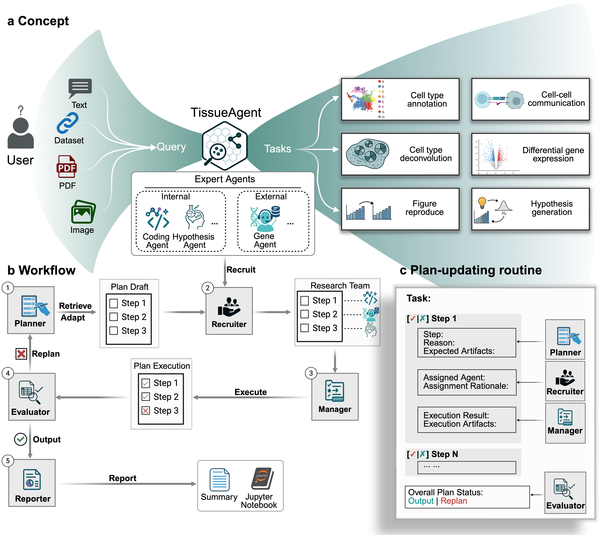

# TissueAgent: A Role-Based Multi-Agent Framework for Reproducible Spatial Transcriptomics Workflows

## Project Overview

TissueAgent is a role-based multi-agent framework that turns open-ended natural-language ST requests and multimodal inputs (data, PDFs, images) into auditable, runnable workflows. A single evolving plan coordinates specialized agents and records rationales, step status, and artifact links, enabling transparent provenance and targeted replanning. By separating planning, recruitment, execution, evaluation, and reporting, TISSUEAGENT is designed to improve reliability across heterogeneous, multi-stage analyses.

## Key Features

- Role-based multi-agent design with explicit separation of planning, recruitment, execution, evaluation, and reporting.
- A single evolving plan that tracks rationales, step status, and artifact links to support transparent provenance and targeted replanning.
- Built-in collaboration with external specialized agents to extend capabilities for domain-specific tasks.
- Support for diverse spatial transcriptomics workflows such as figure reproduction, cell type annotation, cell-cell communication, differential gene expression, and cell type deconvolution.



## Execution modes

TissueAgent runs in one of two modes, controlled by a toggle in the web UI's sidebar:

- **Autopilot** *(default)* — the planner, recruiter, manager, evaluator, and reporter run end-to-end without pausing. This is the only mode available outside the web UI (notebook and CLI entry points always run autopilot).
- **Copilot** — the run pauses after the planner finishes drafting the plan, and again after the recruiter assigns agents. At each pause the plan panel surfaces four actions:
  - **Approve** to accept and continue,
  - **Edit** to modify the plan markdown (or change per-step agent assignments) and resume,
  - **Send feedback** to give free-text guidance that rewinds the run back to the planner,
  - **Cancel run** to abort and start fresh.

Mode is persisted with the session and survives reloads. Switching modes mid-run is blocked — finish or cancel the current run first.

## Project Structure

```text
TissueAgent/
├── src/
│   ├── agents/
│   │   ├── planner_agent/
│   │   │   └── plan_registry/     # YAML workflow templates the planner retrieves
│   │   ├── recruiter_agent/
│   │   ├── manager_agent/
│   │   ├── evaluator_agent/
│   │   ├── reporter_agent/
│   │   ├── agent_registry/        # domain/specialized agents and tools
│   │   └── skill_registry/        # shared markdown playbooks (scaffold; not wired)
│   ├── graph/                     # workflow graph/state orchestration
│   ├── server/                    # FastAPI backend and routes
│   └── frontend/                  # React + TypeScript frontend
├── demo/                          # notebooks, sample inputs, and outputs
├── workspace/                     # local datasets and analysis inputs
├── docs/figures/                  # README/manuscript figures
├── notebooks/                     # exploratory notebooks
├── logs/                          # runtime logs
├── sessions/                      # run/session artifacts
├── pyproject.toml                 # Python project configuration
├── environment.yml                # Conda environment definition
└── flake.nix                      # Nix development environment
```

## Repository set-up

1. Clone the repository **with submodules** and `cd` into the local directory
   ```bash
   git clone --recurse-submodules https://github.com/ma-compbio/TissueAgent
   cd TissueAgent
   ```
   If you already cloned without `--recurse-submodules`, initialize them manually:
   ```bash
   git submodule update --init --recursive
   ```

2. Set up your LLM credentials. See [LLM credentials](#llm-credentials) below for the full list of supported providers and models. At minimum, one provider key is required — by default that's `OPENAI_API_KEY`:
   ```bash
   export OPENAI_API_KEY="sk-..."
   export ANTHROPIC_API_KEY="sk-ant-..."     # optional, for Claude models
   export OPENROUTER_API_KEY="sk-or-..."     # optional, for OpenRouter
   ```
   You can also paste keys directly into the web UI (sidebar → **API keys**); UI values override env vars and stay in server memory until cleared.

### Option A1: Using conda

1. [Install Miniconda](https://docs.anaconda.com/miniconda/) or [Anaconda](https://www.anaconda.com/download) if you haven't already.

2. Create the conda environment and install dependencies:
   ```bash
   conda env create -f environment.yml
   conda activate tissueagent
   pip install -e .       # installs Python deps from pyproject.toml
   cd src/frontend
   npm install            # installs React/TypeScript deps
   cd ../..
   ```

3. Start the application (two terminals, both with `conda activate tissueagent`):
   ```bash
   # Terminal 1 — FastAPI backend
   PYTHONPATH=$(pwd)/src uvicorn server.main:app --reload --host 0.0.0.0 --port 8000

   # Terminal 2 — React dev server (hot-reload)
   cd src/frontend
   npm run dev
   ```

4. Open **http://localhost:5173** in a web browser. The React dev server proxies API and WebSocket requests to the FastAPI backend automatically.

#### Production mode (single process)

```bash
conda activate tissueagent
cd src/frontend && npm run build && cd ../..
PYTHONPATH=$(pwd)/src uvicorn server.main:app --host 0.0.0.0 --port 8000
```
Open **http://localhost:8000**. FastAPI serves the built React app as static files.

### Option A2: Using uv

You will need to install the following manually:
- **Python 3.12** — [python.org](https://www.python.org/downloads/) or your system package manager
- **uv** — [docs.astral.sh/uv](https://docs.astral.sh/uv/)
- **Node.js 22+** and **npm** — [nodejs.org](https://nodejs.org/)

1. Install dependencies:
   ```bash
   uv sync              # creates .venv and installs Python deps
   cd src/frontend
   npm install           # installs React/TypeScript deps
   cd ../..
   ```

2. Start the application (two terminals):
   ```bash
   # Terminal 1 — FastAPI backend
   source .venv/bin/activate
   PYTHONPATH=$(pwd)/src uvicorn server.main:app --reload --host 0.0.0.0 --port 8000

   # Terminal 2 — React dev server (hot-reload)
   cd src/frontend
   npm run dev
   ```

3. Open **http://localhost:5173** in a web browser.

#### Production mode (single process)

```bash
source .venv/bin/activate
cd src/frontend && npm run build && cd ../..
PYTHONPATH=$(pwd)/src uvicorn server.main:app --host 0.0.0.0 --port 8000
```
Open **http://localhost:8000**.

### Option B: Using Nix

A Nix flake is provided that supplies Python 3.12, uv, Node.js 22, and npm.

1. [Install Nix](https://nixos.org/download) if you haven't already.

2. Enter the dev shell and install dependencies:
   ```bash
   nix develop          # drops you into a shell with python, uv, node, npm
   uv sync              # creates .venv and installs Python deps
   cd src/frontend
   npm install          # installs React/TypeScript deps
   cd ../..
   ```

3. Start the application (two terminals, both inside `nix develop`):
   ```bash
   # Terminal 1 — FastAPI backend
   source .venv/bin/activate
   PYTHONPATH=$(pwd)/src uvicorn server.main:app --reload --host 0.0.0.0 --port 8000

   # Terminal 2 — React dev server (hot-reload)
   cd src/frontend
   npm run dev
   ```

4. Open **http://localhost:5173** in a web browser. The React dev server proxies API and WebSocket requests to the FastAPI backend automatically.

#### Production mode (single process)

```bash
nix develop
source .venv/bin/activate
cd src/frontend && npm run build && cd ../..
PYTHONPATH=$(pwd)/src uvicorn server.main:app --host 0.0.0.0 --port 8000
```
Open **http://localhost:8000**. FastAPI serves the built React app as static files.

### Option C: Headless Mode

No frontend is needed. Install Python dependencies using either conda or uv, then run TissueAgent directly from a Jupyter notebook.

**Using conda:**
```bash
conda env create -f environment.yml
conda activate tissueagent
pip install -e .
```

**Using uv:**
```bash
uv sync
```

See `demo/` for examples on how to invoke TissueAgent from a notebook.

> [!TIP]
> All agents use GPT-5 by default. To save API tokens, models with lower reasoning capabilities can be used. This can be configured globally by modifying `DefaultModelCtor` in `src/config.py` or changed on the subagent level by modifying `src/agents/agent_defns.py`.

## Demo

TissueAgent can be invoked in two ways:

### Option 1: Through Web UI

Start the backend server:
```bash
PYTHONPATH=$(pwd)/src uvicorn server.main:app --host 0.0.0.0 --port 8000
```

**Web UI Demo:**

https://github.com/user-attachments/assets/ef381418-cf5c-431b-9052-f931c922d2c8

### Option 2: From Notebooks

Notebook-based demos are available in `demo/` and can be run end-to-end to reproduce manuscript tasks.

**Run a demo:**

1. Complete repository setup above and activate the environment

2. Export your LLM credentials (see [LLM credentials](#llm-credentials) for the full list):
   ```bash
   export OPENAI_API_KEY="sk-..."
   export ANTHROPIC_API_KEY="sk-ant-..."     # optional, for Claude models
   export OPENROUTER_API_KEY="sk-or-..."     # optional, for OpenRouter
   ```
3. Launch Jupyter:
   ```bash
   jupyter notebook
   ```
4. Open and run a notebook from top to bottom.

**Available notebooks:**

- `demo/figure_recreation_lohoff-2b.ipynb`: figure reproduction workflow demo 1
- `demo/figure_recreation_lohoff-2e.ipynb`: figure reproduction workflow demo 2
- `demo/spot_deconvolution_visium_heart.ipynb`: cell-type deconvolution task

Outputs are written to `workspace/` and copied into `demo/outputs/{TASK}`. Execution transcripts are saved to `demo/outputs/{TASK}/transcript.log`.

See `demo/README.md` for more details.

## LLM credentials

TissueAgent supports different providers. You only need a key for the providers whose models you intend to use. At least one provider key must be available before the agent can run.

You can supply keys in two ways:

- **Environment variable** (recommended for headless or notebook use). Export the variables listed below before launching the server or notebook.
- **Through the web UI**: open the sidebar → **API keys** and paste a key per provider. UI-typed keys are held in server memory only, override the matching env var while set, and can be cleared from the same UI.

| Provider | Get a key | Environment variable | Default model | Other supported models |
|---|---|---|---|---|
| **OpenAI** | https://platform.openai.com/api-keys | `OPENAI_API_KEY` | `gpt-5.1` *(global default)* | `gpt-5.4`, `gpt-5`, `gpt-5-mini` |
| **Anthropic** | https://console.anthropic.com/settings/keys | `ANTHROPIC_API_KEY` | `claude-opus-4-7` | `claude-sonnet-4-6` |
| **OpenRouter** | https://openrouter.ai/keys | `OPENROUTER_API_KEY` | `openrouter/gpt-5.1` | `openrouter/gpt-5.4`, `openrouter/gpt-5`, `openrouter/gpt-5-mini`, `openrouter/claude-opus-4-7`, `openrouter/claude-sonnet-4-6` |


**Model selection.** The UI exposes two dropdowns in the sidebar:

- **Orchestration agents** — the planner / recruiter / manager / evaluator / reporter
- **Expert agents** — the worker sub-agents (coding, hypothesis, single-cell, etc.)

Changing the orchestration model also updates the expert model by default; click **sync** next to the Expert dropdown to re-link them after you've changed it independently. Model changes take effect on your next message.

## External agents

TissueAgent integrates third-party research agents through a thin adapter layer. The included external agent is **GeneAgent** ([ncbi-nlp/GeneAgent](https://github.com/ncbi-nlp/GeneAgent)), which interprets a gene list and returns a verified biological-process narrative.

### Installing GeneAgent

GeneAgent's source is included as a git submodule pinned to a tested upstream commit. The standard `git clone --recurse-submodules ...` from the [repository set-up](#repository-set-up) section fetches it automatically. If you cloned without `--recurse-submodules`, run:

```bash
git submodule update --init --recursive
```

This populates `src/agents/agent_registry/gene_agent/upstream/` with the GeneAgent repository. No additional pip install is required. TissueAgent imports the upstream code directly through its adapter.

**Verify the submodule is present:**

```bash
ls src/agents/agent_registry/gene_agent/upstream/main_cascade.py
```

If the file is missing, re-run the `git submodule update` command above.

### Credentials and model

GeneAgent always calls **OpenAI `gpt-5.1`** regardless of which model you've selected for TissueAgent's orchestration or expert agents. This keeps GeneAgent's behavior reproducible across sessions. You must therefore have `OPENAI_API_KEY` available (as an environment variable or pasted into the web UI's *API keys* panel) before invoking the Gene Agent.

### Artifacts

Each Gene Agent invocation writes to `data/gene_agent/<request_id>/` — a final summary, a claims-and-verification log, and the initial GPT response. The absolute paths are returned in the tool output so downstream agents and the user can reference them.

### Adding your own external agent

The full integration recipe — file structure, manifest schema, LLM-compatibility shim, common pitfalls — is documented in [`INTEGRATING.md`](INTEGRATING.md) at the repository root, with the Gene Agent integration as the worked example. A copy-paste skeleton lives at `src/agents/agent_registry/_template_external_agent/`.

## Data Availability

All datasets referenced in the manuscript are publicly available:
- Developing human heart MERFISH dataset (Farah et al., 2024): [https://cells.ucsc.edu/?ds=hoc](https://cells.ucsc.edu/?ds=hoc)
- 10x Visium human heart dataset (Kanemaru et al., 2023): [https://www.heartcellatlas.org/](https://www.heartcellatlas.org/)
- Single-cell reference dataset for cell type deconvolution: [CellxGene collection b52eb423](https://cellxgene.cziscience.com/collections/b52eb423-5d0d-4645-b217-e1c6d38b2e72)
- 10x Visium Alzheimer's disease spatial transcriptomics dataset (Miyoshi et al., 2024): GEO accession [GSE233208](https://www.ncbi.nlm.nih.gov/geo/query/acc.cgi?acc=GSE233208)
- Spatial mouse atlas (Lohoff et al., 2022): [https://crukci.shinyapps.io/SpatialMouseAtlas/](https://crukci.shinyapps.io/SpatialMouseAtlas/)
- Spatiotemporal transcriptomics dataset (Chen et al., 2022): CNGBdb accession [STDS0000058](https://db.cngb.org/search/project/STDS0000058/)

### License

[MIT License](LICENSE)
