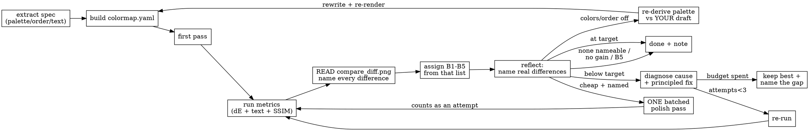

# Panel geometry — measuring the target before you plot

Colour is not the only thing that must be decided *before* rendering. Canvas
shape, background, orientation, legend placement and margins are all measurable
from the target, and each one discovered *after* rendering costs a re-render
against a bounded attempt budget.

This page holds the measurement code and the full rationale. The skill's step 6
carries the rule; read this when you need the how.

## The precheck
   The colormap is not the only thing that must be decided *before* you plot.
   Canvas shape, background, orientation and legend placement are equally
   measurable from the target, and getting one wrong costs a whole re-render.
   Read them off the target and write them into `spec.yaml` (or a sibling
   `panel_spec.yaml`) so the plotting code has a single source of truth:

   ```python
   from PIL import Image; import numpy as np
   a = np.array(Image.open(target).convert("RGB")); h, w, _ = a.shape
   # Background: probe INBOARD. Corners lie -- bbox_inches="tight" keeps a white
   # figure margin around a black axes, so both can read white at the corners.
   bg = np.median(np.stack([a[h//2, w//20], a[h//20, w//2], a[h//2, w-w//20]]), axis=0)
   mask = np.abs(a.astype(int) - bg).sum(2) > 40
   ys, xs = np.nonzero(mask)
   print("canvas   :", w, "x", h, "aspect w/h = %.3f" % (w / h))
   print("bg rgb   :", bg.astype(int), "(dark)" if bg.mean() < 128 else "(light)")
   print("content  : bbox", (xs.min()/w, ys.min()/h, xs.max()/w, ys.max()/h),
         "fill %.3f" % mask.mean())
   print("col dens :", [round(float(mask[:, i*w//20:(i+1)*w//20].mean()), 2) for i in range(20)])
   ```

   Decide and record, before writing any plotting code:

   - **Canvas shape** — set `figsize` to the target's width:height ratio. A
     portrait target rendered as landscape is a defect every similarity metric is
     blind to (they square both images first).
   - **Background** — match the target's panel colour. Do not set a dark
     `facecolor` unless the measurement says the target has one.
   - **Aspect lock** — for spatial/image-derived panels use
     `ax.set_aspect("equal")` so tissue is not stretched.
   - **Orientation** — spatial panels are frequently image-convention: decide
     whether you need `ax.invert_yaxis()` / `origin="upper"` from where a
     distinctive feature sits in the target, and record the decision.
   - **Legend** — the column-density readout shows whether the target reserves a
     block for a legend/colorbar. A legendless target means `legend=False`; adding
     one changes the composition and shrinks the panel.
   - **Margins/extent** — the content bbox says how much of the canvas the data
     occupies; match it with `bbox_inches="tight"` plus figsize rather than by
     eye.

   These are cheap to measure and expensive to discover later — step 8's pass 2 checks
   every one of them against your render, and a mismatch there costs an attempt
   from the budget.

### Phase C — Render *(step 7, plus the CSV from step 13)*


## Why each one matters

* **Canvas shape** — every similarity metric squares both images before
  comparing, so a portrait target rendered as landscape scores identically to a
  correct one. Nothing will tell you; measure it.
* **Background** — a dark facecolor behind a light target recolours every pixel
  between markers and collapses SSIM while the anatomy is perfectly right.
* **Orientation** — spatial panels are often image-convention. Decide from where
  a distinctive feature sits, and record the decision so a later reader can check
  it rather than re-guess.
* **Legend** — a legendless target means `legend=False`; adding one shrinks the
  panel and changes the composition. Conversely, dropping a legend the target has
  strips the key that makes the colours mean anything.
* **Margins/extent** — the content bbox says how much of the canvas the data
  occupies; match it with figsize plus `bbox_inches="tight"`, not by eye.

---

## Workflow diagram


