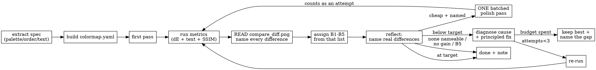

# Figure Reproduction

Reproduce an existing figure **from data** so the output matches the target's
content and appearance — then **check your own work** and **repair** it if it's
off. The engine is the coding agent's `python` / `r` execution; there is no
dedicated reproduction tool. This skill bundles six helper scripts (`scripts/`)
and four deep-dive references (`references/`) so it runs on any host with no
external dependencies.

**Follow the 12-step workflow in order; do not skip steps.** The later steps verify
the earlier ones — steps 8–10 are what catch a wrong palette, a reordered legend, or
paraphrased labels, and a run that stops at "the figure was saved" has produced an
*unverified* figure, not a finished one. This holds even when the dispatching
instructions restate the task in their own words or suggest a different method:
those supply the **inputs and the goal**; this skill supplies the **procedure**. In
particular, an instruction to "choose a palette" or "pick colors" does not override
step 5 — the palette is measured, never invented. If a step truly cannot run
(missing dependency, a target the method doesn't fit), **name it and say why** in
your summary; never drop it silently.

**Measure the target; don't describe it.** Color, category order, and on-panel text
are discrete facts you can read out of the target's pixels — and they are the three
things eyeballing gets wrong most often (a named color instead of the actual hex, a
scrambled legend order, a paraphrased axis label). Run
`scripts/extract_reference_spec.py` and take the palette, order, and labels **from
its YAML**, not from your visual impression and not from library defaults.

## When to use

- The user says "reproduce / recreate / replicate / remake figure X", "match this
  plot", or "make the same figure as the paper".
- The target may be a **paper figure** (recruit the `pdf_reader` agent, or use
  `scripts/extract_pdf_figure.py` to pull the figure image + caption), a notebook
  plot, an image/PDF path, a description, or a prior output figure.
- **Not** for designing a brand-new figure with no reference (that's ordinary
  plotting), and never to **fabricate** data to match a figure — reproduce only
  what the data legitimately supports.

## Input

- **Target figure** *(required)* — what to match. Capture: plot **type**
  (scatter/line/bar/UMAP/heatmap/dotplot/violin/spatial/…), **panels/facets**, the
  **color encoding** (by category / group / continuous value / gene), axes, and any
  legend/annotations. Copy on-panel text **verbatim** — you will need it later.
- **Dataset** *(required)* — the table/matrix/`.h5ad` the figure is computed from.
  Confirm it holds the fields the figure needs (the coordinates/embedding, the
  color column, the variable/gene). Use `scripts/inspect_dataset.py <path>`.
- **Reference spec** *(derived, required when the target is an image)* — run
  `scripts/extract_reference_spec.py <target> -o spec.yaml` to measure the target's
  **palette** (hex), **category order** (legend/tick reading order), **colormap**
  (including `_r` reversal), and **on-panel strings**. This is ground truth for the
  plotting code; prefer it over any guess. A supplied palette file (e.g. the demos'
  `colormap.yaml`) supersedes it.
- **Style hints** *(optional)* — point size, figure size/DPI, panel grid. Default to
  the target's apparent style; record any guess.

## Output

- **Reproduced figure** — saved under the active project's `outputs/` (e.g.
  `outputs/figures/<name>.png`, 150+ DPI). Save a vector copy (`.pdf`/`.svg`) too
  when the target is publication-quality.
- **Plotted-data table** — a CSV of exactly what was plotted (coords + color field,
  or the matrix behind a heatmap) so the figure is auditable and reusable.
- **`colormap.yaml`** (step 5) and **`compare_metrics.json`** (step 8) — the resolved
  palette with its source tier, and the fidelity comparison. These two files are what
  distinguish a *checked* reproduction from one that merely rendered; write them under
  `outputs/tables/` so the plan's artifact verifier can see them.
- **A short repro note** — which dataset fields, parameters, and assumptions
  produced the figure, the fidelity self-check result, plus any deviations from the
  target and why.

## Success Criteria

- The figure file exists, is non-empty, and renders (the `python` tool returns it
  inline — you can **see** it and compare against the target).
- **Content matches**: same plot type, same number of panels, same color encoding,
  same groups (categories present and their relative positions/trends agree with
  the target).
- **Color, order and labels are measured, not guessed**: the palette and category
  order came from `scripts/extract_reference_spec.py` (or a supplied palette file),
  every color in the code is an explicit hex/identified colormap, and on-panel text
  is verbatim. Where a measurement was unavailable (e.g. no OCR), say which and how
  you filled the gap.
- **Fidelity self-check done**: you self-evaluated the reproduction against the
  target — a metric prior (`scripts/compare_figures.py`, including palette dE and
  the text diff) **and** your own visual B-level judgment (see
  `references/fidelity-check.md`); a result below your target level was either
  repaired or its residual gap is **named** in the note. Signals the script could
  not compute do not count as passes. (The self-check is expected; the gate is that
  any shortfall is repaired or named.)
- The plotted-data CSV exists and its row/column counts match the dataset subset
  shown.
- Deviations are **named** in the note, not silently introduced.
- Honest-failure: if the dataset lacks a field the figure needs, say so and propose
  the closest reproducible variant — don't invent data.

## Anti-cheating (non-negotiable)

Regenerate the figure by **running code against the data**. Never: copy a
pre-existing image to the output; decode an image stored in a notebook's cell
outputs; download the target panel; or synthesize a plausible-looking image without
running the analysis. If you cannot reproduce it honestly, say so and record the
concrete blocker — never fabricate.

## Workflow

These 12 steps are the whole procedure. A plan may dispatch them to you in **four
slices** (below) rather than all at once — if your task instructions cover only one
slice, run that slice's steps and stop; if they cover the whole reproduction, run all
12 in order. Either way the method is the same and no step is optional.

| Plan step | Workflow steps | Produces |
|---|---|---|
| 1 — Prepare & measure | 1–4 | `spec.yaml`, dataset inventory |
| 2 — Resolve the colormap | 5 | `tables/colormap.yaml` |
| 3 — Render | 6–7, CSV half of 12 | `figures/<name>.png` + vector, plotted-data CSV |
| 4 — Verify & repair | 8–11, note half of 12 | `tables/compare_metrics.json`, `compare_diff.png`, repro note |

### Plan step 1 — Prepare & measure the target *(workflow steps 1–4)*

1. **Preflight the environment.** Run `scripts/env_preflight.py` to confirm the
   plotting stack (and, if relevant, `Rscript`) is present; install what's missing
   with the printed hints. Record uninstallable deps as obstacles instead of
   crashing.
2. **Acquire the target.** If it's a paper figure, recruit `pdf_reader` (or run
   `scripts/extract_pdf_figure.py <pdf> --fig "Figure N"`) to pull the figure image
   + full caption. For a single **sub-panel**, view the page then isolate it with
   `--crop x0,y0,x1,y1`, and read that panel's caption text (the `a`/`b`/`c`… part).
   Identify plot type, panels, color encoding, and copy on-panel text **verbatim**.
   **Target-of-record:** if the PDF panel is a schematic/photo or plainly isn't the
   plot your dataset yields, the true reference may be the authors' plotting-code
   output or the caption's *described* plot — reproduce **that** (and if you
   regenerate the reference from the repo's own script, note it's a consistency
   check, not an independent match). If the panel isn't derivable from the data at
   all, say so — honest-failure.
3. **Extract the reference spec** — `scripts/extract_reference_spec.py <target> -o
   spec.yaml`. Measures the palette, legend/tick **order**, colormap, and on-panel
   text from the target's pixels. Read the YAML and use it in step 7; do **not**
   re-derive these by eye. Notes:
   - The legend box is auto-detected. If the entries look wrong (duplicate colors,
     scattered positions, or a count that doesn't match the panel), pass
     `--legend-box x0,y0,x1,y1` and check the crop with `--debug-crops dir/`.
   - For a continuous panel, pass `--colorbar-box` to identify the colormap — this
     is what catches a reversed map (`RdBu_r` vs `RdBu`).
   - Label/tick text needs `pytesseract` + the `tesseract` binary. Without them the
     colors and order still extract; labels come back `null`, so fall back to
     reading the text off the panel **verbatim** yourself.
   - **Know when extraction cannot work.** A palette is only recoverable if the
     figure renders it: a **legendless dense scatter of sub-pixel markers** (many
     categories, small raster, JPEG artifacts) blends every marker with the
     background and its neighbours, so the true colors are simply not present in the
     image. Measured on the Lohoff 2b reference (22 cell types, 380×494): only 10 of
     22 true colors had *any* pixel within dE 5, so no algorithm could recover the
     rest. Symptoms: extracted colors look washed out/greyed, several distinct
     categories collapse onto one hue, or `legend.entries` is empty. When you see
     this, **say so and get the palette from the data instead** — a supplied
     `colormap.yaml`, `adata.uns["<key>_colors"]`, or the analysis that defined the
     categories — rather than trusting a spec you can see is degraded. A dense
     scatter's *dominant* colors are still informative; its *rare* categories are
     not.
4. **Inspect the dataset** with `scripts/inspect_dataset.py <path>` (or the `python`
   tool): shape, columns / `.obs` / `.obsm` / `var_names`, candidate color columns
   and embeddings. **Confirm every field the figure needs exists** before plotting.
### Plan step 2 — Resolve the colormap *(workflow step 5)*

5. **Build the colormap — always produce one.** Run
   `scripts/build_colormap.py --dataset <data> [--key <obs col>] [--palette <file>]
   [--reference <target>] -o colormap.yaml`. It resolves colors from the most
   trustworthy source available and records which:

   | Tier | Source | Trust |
   |---|---|---|
   | 1 | a supplied palette file | exact — wins outright |
   | 2 | colors stored in the data (`uns["<key>_colors"]`) | exact |
   | 3 | the reference figure's **legend** swatches | exact when a legend exists |
   | 4 | pixels sampled off the panel | only if `palette_reliability` is OK |
   | 5 | a documented default palette (`--allow-default`) | a **deviation** — name it |

   Category **names and order** come from the dataset whenever it has them, and are
   independent of where the colors came from. If the script **refuses**, that is the
   correct outcome — it means no trustworthy source exists; supply one rather than
   letting the plot fall back to library defaults. Plot from `colormap.yaml`, and
   reuse the same file across every panel that shares categories so colors stay
   consistent between figures.
### Plan step 3 — Render *(workflow steps 6–7, plus the CSV from step 12)*

6. **Find the plotting API** with `search_documentation` (or your knowledge) — pick
   the primitive that matches the target's encoding (e.g. `sc.pl.umap`,
   `sc.pl.spatial`, `sc.pl.dotplot`, `seaborn`/`matplotlib` equivalents).
7. **Render a first pass** with `python`, saving to `outputs/figures/`. Plot **only
   the subset the panel shows** (right rows/series/categories, in the shown order),
   copy labels **verbatim**, and keep any background/histology image as the
   underlay. Drive color/order/labels from `spec.yaml`: an explicit `#RRGGBB` per
   category, an explicit category order, the identified `cmap`. **No named colors
   (`"blue"`, `"tab:blue"`, `C0`) and no default palette or colormap** — every color
   should trace to a measured value. Set a seed for any randomness (sampling,
   jitter, layout) so re-runs are stable. The tool returns the image inline;
   **look at it**.
### Plan step 4 — Verify & repair *(workflow steps 8–11, plus the note from step 12)*

8. **Run the metrics.** `scripts/compare_figures.py <target> <repro> --out
   compare_diff.png --json > outputs/tables/compare_metrics.json` reports a
   pHash/SSIM/ORB prior, **palette dE**, an **OCR text diff**, and a B-level that is
   the *minimum* across those signals (so a high SSIM can't mask a wrong palette or
   rewritten labels). Note which signals it could **not** compute — a missing signal
   is not a pass. **Save the JSON**: it and `colormap.yaml` are the evidence that
   this figure was checked rather than merely produced, and the plan's artifact
   verifier looks for them.
9. **Look at the two figures side by side — do not skip this.** The script wrote
   `compare_diff.png` (target | reproduction, matched height). **`read()` that
   path** so the image enters your context; it is written to disk, *not* returned
   inline, so it does not appear unless you open it. Then walk the panel
   deliberately and **name every difference you can see** before scoring:

   > colors and which category each is bound to · category / legend / row order ·
   > axis, tick, legend and title text (wording, units, capitalisation) · marker
   > size, opacity, density · aspect ratio and axis limits · background or
   > histology underlay · panel spacing and figure proportions · colorbar range,
   > direction and ticks · anything present in one figure and absent in the other

   Write that list down, then assign the **B1–B5 level from the list**
   (`references/fidelity-check.md`) — not from an overall impression, which is how
   a wrong palette or a reordered legend gets waved through. Cross-check the two
   things the metrics don't cover: **category order** (against `spec.yaml`) and any
   skipped signal.
10. **Reflect on quality — once, even if the level is acceptable.** Ask: *what would
   make this closer to the target?* Name the top 2–3 concrete improvements. Apply
   the cheap ones — a plotting-cell re-run for palette, order, labels, sizing,
   aspect, underlay — in **one batched polish pass**. Record anything expensive or
   unsupported by the data as a residual gap in the repro note.

   **This step runs at most twice per panel, and the second time only if the first
   polish pass fixed a difference you could name.** Bound it:
   - **One polish pass** is the default. Batch every cheap fix into a single
     re-render rather than one fix per cycle.
   - **Stop immediately** when the remaining items are aesthetic preferences rather
     than named differences from the target ("could be prettier" is not a
     difference), when a pass produces no B-level or difference-list improvement, or
     when you are at B5.
   - Polish passes **do** count against the ≤3 reproduction attempts in step 11 —
     they are re-renders like any other. They are cheap, not free.

   "Good enough" is the exit condition for the repair loop, not a reason to ship a
   figure that is one cheap change from right — but "one cheap change" is a claim
   about a *named difference*, and when you can't name one, you are done.
11. **Reflect-and-retry (bounded).** If the result is unsatisfactory, diagnose the
   cause and apply one **principled fix**, then re-run from the smallest step that
   changes. Cap the effort: **≤3 reproduction attempts**, and **≤1** "go back and
   re-prep the data/environment" round-trip. Full loop:
   `references/reflect-and-retry.md`. If still short, keep the best attempt and
   **name the residual gap**.
12. **Export the plotted-data CSV** and write the repro note (fields used, params,
   fidelity result, deviations). Write the CSV with categories **in plotted order**
   so the order is auditable as text, without any image analysis.



## Bundled scripts (`scripts/`, portable, no external deps)

| Script | Use |
|---|---|
| `env_preflight.py` | Report Python/R + plotting libs present/missing + install hints. |
| `extract_pdf_figure.py <pdf> [--page N]` | Extract figure image(s) + caption from a paper PDF (autonomous target acquisition). |
| `inspect_dataset.py <path>` | Structure of `.h5ad`/`.csv`/`.tsv`/`.parquet`/`.xlsx`: shape, columns, embeddings, candidate color fields. |
| `extract_reference_spec.py <target> -o spec.yaml` | **Measure** the target's palette (hex), category **order**, colormap (incl. `_r`), and on-panel text. Run before writing plotting code. |
| `build_colormap.py -o colormap.yaml` | Resolve the palette from the **most trustworthy source available** (supplied file → dataset colors → reference legend → refuse) and stamp which tier it used. |
| `compare_figures.py <orig> <repro>` | pHash/SSIM/ORB + **palette dE** + **text diff**; B-level prior = the min across signals. |

Each runs on plain `python` and degrades gracefully if an optional library is
absent (it tells you what to install). Run any with `--help`.

## Code Template

```python
import matplotlib.pyplot as plt
from pathlib import Path

out = Path("outputs/figures"); out.mkdir(parents=True, exist_ok=True)

# ── colors come from colormap.yaml (step 5), never from library defaults ─────
import yaml
palette = yaml.safe_load(open("colormap.yaml"))   # {category: "#RRGGBB"}, ordered
order   = list(palette)                            # the target's category order
# build_colormap.py stamped the source tier in the file's header comment — if it
# says "5-default", these are NOT the target's colors: say so in the repro note.

# For a continuous panel, take the colormap from the measured spec instead:
#   spec = yaml.safe_load(open("spec.yaml"))
#   cmap = spec["colorbar"]["best"]                # e.g. "RdBu_r" — mind the _r

# ── domain-agnostic table example ────────────────────────────────────────────
import pandas as pd
df = pd.read_csv("uploads/plotted_data.csv")
print(df.shape, list(df.columns), df.dtypes.to_dict())   # confirm fields first
sub = df[df["group"].isin(order)]             # ONLY the subset the panel shows
fig, ax = plt.subplots(figsize=(4, 4))
for g in order:                               # loop IN ORDER → legend + z-order match
    d = sub[sub["group"] == g]
    ax.scatter(d["x"], d["y"], s=6, c=palette[g], label=g, linewidths=0)
ax.set_xlabel("UMAP 1"); ax.set_ylabel("UMAP 2")   # labels VERBATIM from the target
ax.legend(title="group")
plt.savefig(out / "reproduced.png", dpi=200, bbox_inches="tight")
plt.savefig(out / "reproduced.pdf", bbox_inches="tight")      # vector copy
sub.to_csv(out / "reproduced_points.csv", index=False)         # audit/reuse

# Continuous color instead of categories? Use the identified colormap, not a default:
#   cmap = spec["colorbar"]["best"]           # e.g. "RdBu_r" — note the _r
#   ax.scatter(d["x"], d["y"], c=d["value"], cmap=cmap, vmin=lo, vmax=hi)

# ── omics example (light): a spatial scatter colored by cell type ────────────
# import scanpy as sc
# adata = sc.read_h5ad("uploads/dataset.h5ad")
# print(adata.shape, list(adata.obs.columns), list(adata.obsm.keys()))
# adata.obs["cell_type"] = adata.obs["cell_type"].cat.reorder_categories(order)
# adata.uns["cell_type_colors"] = [palette[c] for c in order]   # exact palette
# sc.pl.embedding(adata, basis="spatial", color="cell_type", show=False)
# plt.gca().set_aspect("equal"); plt.axis("off")
# plt.savefig(out / "reproduced.png", dpi=200, bbox_inches="tight")
```

**Never** `color="blue"` / `"tab:blue"` / `C0`, and never an unexamined default
`cmap`. Every color in the reproduction should trace to a value you measured.

Concrete per-plot recipes (scatter/UMAP, heatmap, dotplot, bar/violin, spatial):
`references/domain-recipes.md`.

## Common Issues

- **Missing field → can't reproduce as-is.** The target colors by a
  column/embedding the dataset lacks. Compute it if the data supports it (run the
  relevant analysis first), or reproduce the closest supported variant and say so.
- **Identifier mismatch.** A figure keyed by gene/feature won't plot if names use a
  different ID scheme — map identifiers first.
- **Category/palette mismatch.** Categories render in a different order or different
  colors than the target. Don't fix this by eye: run
  `scripts/extract_reference_spec.py` and set the category order and color map from
  its YAML. Naming a color from a downsampled image ("looks blue" → `tab:blue`) is
  the single most common source of this error, and grayscale metrics can't see it.
- **Wrong colormap direction.** `RdBu` vs `RdBu_r` is a frequent miss on continuous
  panels and inverts the figure's meaning. Identify it with `--colorbar-box` rather
  than guessing.
- **Paraphrased labels.** Axis/legend/tick text rewritten rather than copied
  (`"expression"` for `"Expression (log2 CPM)"`). The `compare_figures.py` text diff
  flags these as near-misses when OCR is available; otherwise copy them verbatim.
- **Wrong plot primitive.** A "heatmap" in a paper may be a clustermap, matrixplot,
  or dotplot — match the actual encoding.
- **Missing input file.** Before declaring a data/script input missing, **search
  for it by basename** across the mounted roots — authors often hard-code a path
  that ships at a different location. See the playbook.
- **Blank/None image.** Reproduction runs in the coding sandbox; a missing kernel
  produces no inline image. Ensure the code-execution backend is reachable.
- **Over-matching.** Don't tweak data or thresholds just to make the picture look
  identical — reproduce what the data legitimately yields and document differences.

The full symptom → fix taxonomy (code, data, environment, methodology — including
stochastic embeddings and figure-duplication traps): `references/debugging-playbook.md`.

## References

- **Deep-dive docs (progressive disclosure):**
  `references/fidelity-check.md` (self-evaluation rubric + `compare_figures.py`),
  `references/reflect-and-retry.md` (the bounded self-repair loop + fix categories),
  `references/debugging-playbook.md` (symptom → fix taxonomy),
  `references/domain-recipes.md` (concrete per-plot recipes).
- Driven by the coding agent (`coding_agent`) tools: `python`, `r`, `search_documentation`.
- Target extraction from papers: the `pdf_reader` agent, or `scripts/extract_pdf_figure.py`.
- Related plan template: `spatial_scatter` (`knowledge/plans/spatial_scatter.md`) — a
  concrete figure recipe with coords/color/checks.
- External plotting APIs (searchable via `search_documentation`): matplotlib,
  seaborn, pandas `.plot`, scanpy `sc.pl.*`, squidpy `sq.pl.*`.
