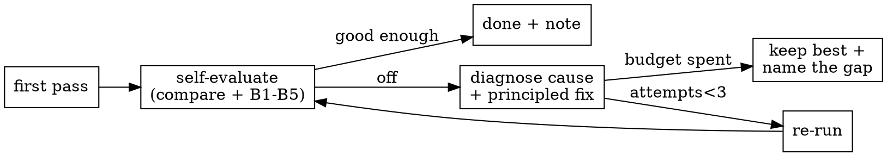

# Figure Reproduction

Reproduce an existing figure **from data** so the output matches the target's
content and appearance — then **check your own work** and **repair** it if it's
off. The engine is the coding agent's `python` / `r` execution; there is no
dedicated reproduction tool. This skill bundles four helper scripts (`scripts/`)
and four deep-dive references (`references/`) so it runs on any host with no
external dependencies.

## When to use

- The user says "reproduce / recreate / replicate / remake figure X", "match this
  plot", or "make the same figure as the paper".
- The target may be a **paper figure** (recruit the `pdf_reader` agent, or use
  `scripts/extract_pdf_figure.py` to pull the figure image + caption), a notebook
  plot, an image/PDF path, a description, or a prior output figure.
- **Not** for designing a brand-new figure with no reference (that's ordinary
  plotting), and never to **fabricate** data to match a figure — reproduce only
  what the data legitimately supports.

## Input

- **Target figure** *(required)* — what to match. Capture: plot **type**
  (scatter/line/bar/UMAP/heatmap/dotplot/violin/spatial/…), **panels/facets**, the
  **color encoding** (by category / group / continuous value / gene), axes, and any
  legend/annotations. Copy on-panel text **verbatim** — you will need it later.
- **Dataset** *(required)* — the table/matrix/`.h5ad` the figure is computed from.
  Confirm it holds the fields the figure needs (the coordinates/embedding, the
  color column, the variable/gene). Use `scripts/inspect_dataset.py <path>`.
- **Style hints** *(optional)* — palette, point size, figure size/DPI, panel grid.
  Default to the target's apparent style; record any guess.

## Output

- **Reproduced figure** — saved under the active project's `outputs/` (e.g.
  `outputs/figures/<name>.png`, 150+ DPI). Save a vector copy (`.pdf`/`.svg`) too
  when the target is publication-quality.
- **Plotted-data table** — a CSV of exactly what was plotted (coords + color field,
  or the matrix behind a heatmap) so the figure is auditable and reusable.
- **A short repro note** — which dataset fields, parameters, and assumptions
  produced the figure, the fidelity self-check result, plus any deviations from the
  target and why.

## Success Criteria

- The figure file exists, is non-empty, and renders (the `python` tool returns it
  inline — you can **see** it and compare against the target).
- **Content matches**: same plot type, same number of panels, same color encoding,
  same groups (categories present and their relative positions/trends agree with
  the target).
- **Fidelity self-check done**: you self-evaluated the reproduction against the
  target — a metric prior (`scripts/compare_figures.py`) **and** your own visual
  B-level judgment (see `references/fidelity-check.md`); a result below your target
  level was either repaired or its residual gap is **named** in the note. (The
  self-check is expected; the gate is that any shortfall is repaired or named.)
- The plotted-data CSV exists and its row/column counts match the dataset subset
  shown.
- Deviations are **named** in the note, not silently introduced.
- Honest-failure: if the dataset lacks a field the figure needs, say so and propose
  the closest reproducible variant — don't invent data.

## Anti-cheating (non-negotiable)

Regenerate the figure by **running code against the data**. Never: copy a
pre-existing image to the output; decode an image stored in a notebook's cell
outputs; download the target panel; or synthesize a plausible-looking image without
running the analysis. If you cannot reproduce it honestly, say so and record the
concrete blocker — never fabricate.

## Workflow

1. **Preflight the environment.** Run `scripts/env_preflight.py` to confirm the
   plotting stack (and, if relevant, `Rscript`) is present; install what's missing
   with the printed hints. Record uninstallable deps as obstacles instead of
   crashing.
2. **Acquire the target.** If it's a paper figure, recruit `pdf_reader` (or run
   `scripts/extract_pdf_figure.py <pdf> --fig "Figure N"`) to pull the figure image
   + full caption. For a single **sub-panel**, view the page then isolate it with
   `--crop x0,y0,x1,y1`, and read that panel's caption text (the `a`/`b`/`c`… part).
   Identify plot type, panels, color encoding, and copy on-panel text **verbatim**.
   **Target-of-record:** if the PDF panel is a schematic/photo or plainly isn't the
   plot your dataset yields, the true reference may be the authors' plotting-code
   output or the caption's *described* plot — reproduce **that** (and if you
   regenerate the reference from the repo's own script, note it's a consistency
   check, not an independent match). If the panel isn't derivable from the data at
   all, say so — honest-failure.
3. **Inspect the dataset** with `scripts/inspect_dataset.py <path>` (or the `python`
   tool): shape, columns / `.obs` / `.obsm` / `var_names`, candidate color columns
   and embeddings. **Confirm every field the figure needs exists** before plotting.
4. **Find the plotting API** with `search_documentation` (or your knowledge) — pick
   the primitive that matches the target's encoding (e.g. `sc.pl.umap`,
   `sc.pl.spatial`, `sc.pl.dotplot`, `seaborn`/`matplotlib` equivalents).
5. **Render a first pass** with `python`, saving to `outputs/figures/`. Plot **only
   the subset the panel shows** (right rows/series/categories, in the shown order),
   copy labels **verbatim**, and keep any background/histology image as the
   underlay. Set a seed for any randomness (sampling, jitter, layout) so re-runs are
   stable. The tool returns the image inline; **look at it**.
6. **Self-evaluate.** Run `scripts/compare_figures.py <target> <repro>` for a
   pHash/SSIM/ORB prior + side-by-side diff, then make your own **B1–B5 visual
   judgment** (`references/fidelity-check.md`). Decide: good enough, or repair?
7. **Reflect-and-retry (bounded).** If the result is unsatisfactory, diagnose the
   cause and apply one **principled fix**, then re-run from the smallest step that
   changes. Cap the effort: **≤3 reproduction attempts**, and **≤1** "go back and
   re-prep the data/environment" round-trip. Full loop:
   `references/reflect-and-retry.md`. If still short, keep the best attempt and
   **name the residual gap**.
8. **Export the plotted-data CSV** and write the repro note (fields used, params,
   fidelity result, deviations).



## Bundled scripts (`scripts/`, portable, no external deps)

| Script | Use |
|---|---|
| `env_preflight.py` | Report Python/R + plotting libs present/missing + install hints. |
| `extract_pdf_figure.py <pdf> [--page N]` | Extract figure image(s) + caption from a paper PDF (autonomous target acquisition). |
| `inspect_dataset.py <path>` | Structure of `.h5ad`/`.csv`/`.tsv`/`.parquet`/`.xlsx`: shape, columns, embeddings, candidate color fields. |
| `compare_figures.py <orig> <repro>` | pHash/SSIM/ORB similarity + side-by-side diff + B-level prior for the fidelity self-check. |

Each runs on plain `python` and degrades gracefully if an optional library is
absent (it tells you what to install). Run any with `--help`.

## Code Template

```python
import matplotlib.pyplot as plt
from pathlib import Path

out = Path("outputs/figures"); out.mkdir(parents=True, exist_ok=True)

# ── domain-agnostic table example ────────────────────────────────────────────
import pandas as pd
df = pd.read_csv("uploads/plotted_data.csv")
print(df.shape, list(df.columns), df.dtypes.to_dict())   # confirm fields first
# plot ONLY the subset the panel shows, in the shown order, with verbatim labels
sub = df[df["group"].isin(["A", "B", "C"])]
fig, ax = plt.subplots(figsize=(4, 4))
for g, d in sub.groupby("group"):
    ax.scatter(d["x"], d["y"], s=6, label=g)
ax.set_xlabel("UMAP 1"); ax.set_ylabel("UMAP 2"); ax.legend(title="group")
plt.savefig(out / "reproduced.png", dpi=200, bbox_inches="tight")
plt.savefig(out / "reproduced.pdf", bbox_inches="tight")      # vector copy
sub.to_csv(out / "reproduced_points.csv", index=False)         # audit/reuse

# ── omics example (light): a spatial scatter colored by cell type ────────────
# import scanpy as sc
# adata = sc.read_h5ad("uploads/dataset.h5ad")
# print(adata.shape, list(adata.obs.columns), list(adata.obsm.keys()))
# sc.pl.embedding(adata, basis="spatial", color="cell_type", show=False)
# plt.gca().set_aspect("equal"); plt.axis("off")
# plt.savefig(out / "reproduced.png", dpi=200, bbox_inches="tight")
```

Concrete per-plot recipes (scatter/UMAP, heatmap, dotplot, bar/violin, spatial):
`references/domain-recipes.md`.

## Common Issues

- **Missing field → can't reproduce as-is.** The target colors by a
  column/embedding the dataset lacks. Compute it if the data supports it (run the
  relevant analysis first), or reproduce the closest supported variant and say so.
- **Identifier mismatch.** A figure keyed by gene/feature won't plot if names use a
  different ID scheme — map identifiers first.
- **Category/palette mismatch.** Categories render in a different order or colors
  than the target — set an explicit category order and color map; don't rely on
  defaults.
- **Wrong plot primitive.** A "heatmap" in a paper may be a clustermap, matrixplot,
  or dotplot — match the actual encoding.
- **Missing input file.** Before declaring a data/script input missing, **search
  for it by basename** across the mounted roots — authors often hard-code a path
  that ships at a different location. See the playbook.
- **Blank/None image.** Reproduction runs in the coding sandbox; a missing kernel
  produces no inline image. Ensure the code-execution backend is reachable.
- **Over-matching.** Don't tweak data or thresholds just to make the picture look
  identical — reproduce what the data legitimately yields and document differences.

The full symptom → fix taxonomy (code, data, environment, methodology — including
stochastic embeddings and figure-duplication traps): `references/debugging-playbook.md`.

## References

- **Deep-dive docs (progressive disclosure):**
  `references/fidelity-check.md` (self-evaluation rubric + `compare_figures.py`),
  `references/reflect-and-retry.md` (the bounded self-repair loop + fix categories),
  `references/debugging-playbook.md` (symptom → fix taxonomy),
  `references/domain-recipes.md` (concrete per-plot recipes).
- Driven by the coding agent (`coding_agent`) tools: `python`, `r`, `search_documentation`.
- Target extraction from papers: the `pdf_reader` agent, or `scripts/extract_pdf_figure.py`.
- Related plan template: `spatial_scatter` (`knowledge/plans/spatial_scatter.md`) — a
  concrete figure recipe with coords/color/checks.
- External plotting APIs (searchable via `search_documentation`): matplotlib,
  seaborn, pandas `.plot`, scanpy `sc.pl.*`, squidpy `sq.pl.*`.
