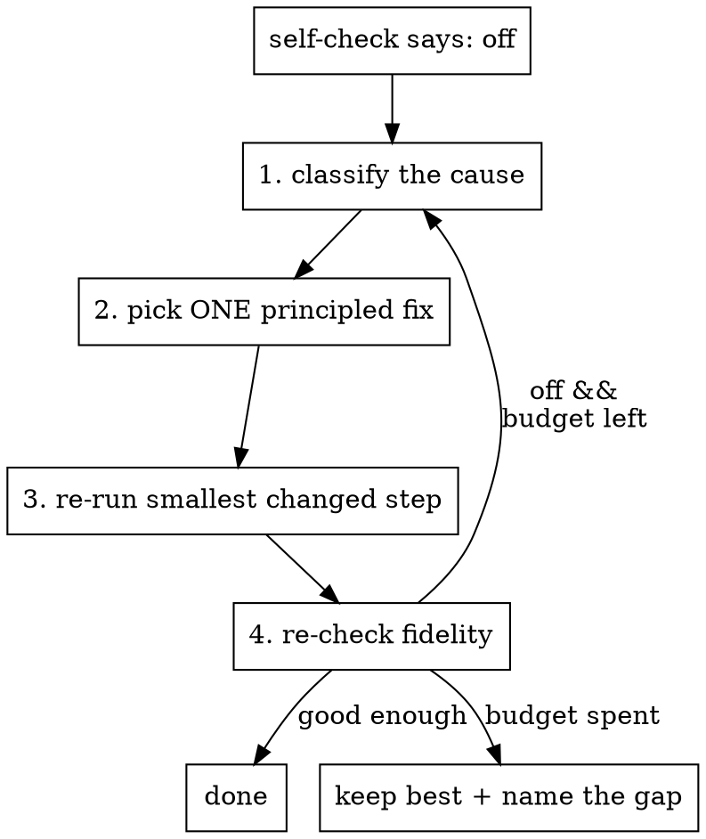

# Reflect-and-retry — the bounded self-repair loop

When the fidelity self-check (`fidelity-check.md`) says the reproduction is off,
don't flail: **diagnose the cause, apply one principled fix, re-run from the
smallest step that changes, re-check.** This is the loop that turns a bad first
pass into a faithful reproduction — with hard budgets so it can never spin forever.

## The loop

## Budgets (do not exceed)

- **≤ 3 reproduction attempts** total for the panel (initial pass + 2 repairs).
- **≤ 1 "go back and re-prep" round-trip** — at most one time you return to
  re-install a dependency or re-fetch/re-shape the data. Repeated plotting tweaks
  within an attempt don't count; a full re-prep does.
- Don't re-request the *same* upstream fix twice. If a re-prep didn't unblock you,
  the blocker is real — record it and stop.

When the budget is spent, **keep the best attempt** and **name the residual gap**
in the repro note (honest-failure beats an infinite loop or a faked match).

## Step 1 — classify the cause

Read the failure precisely (error text, or the visual delta). Assign one:

| Cause | Signal |
|---|---|
| `env-missing` | ImportError / "command not found" / wrong language on PATH |
| `missing-file` | script/loader points at a path that doesn't exist |
| `missing-field` | the color column / embedding / gene the figure needs isn't in the data |
| `wrong-subset` | ran, but plotted the whole sheet instead of the shown rows/series |
| `label-mismatch` | ran, but axis/legend/tick text differs from the target |
| `api-error` | library API changed / wrong function / bad kwargs |
| `undocumented-preprocessing` | ran, but values are off because a normalization/filter step is unstated |
| `stochastic` | output varies run-to-run (embedding rotated, clusters relabeled) |
| `runtime-error` | crash mid-run (memory, shape mismatch, NaNs) |
| `wrong-target` | you're comparing against the wrong reference image entirely |

## Step 2 — pick ONE principled fix

Match the cause to a fix category (a standard figure-repair intervention taxonomy).
Apply the **smallest** fix that addresses the diagnosed cause; record what you did.

| Fix category | What it means | Fixes |
|---|---|---|
| `dep_install` | install a missing Python/R package | `env-missing`, some `api-error` |
| `path_fix` | repoint a hard-coded path to where the file actually is (basename-search first) | `missing-file` |
| `data_relocate` | symlink/copy a found input to the path the script expects | `missing-file` |
| `config_edit` | tweak a YAML/JSON/TOML/INI parameter | `wrong-subset`, some `undocumented-preprocessing` |
| `env_setup` | set an env var / lightweight system dep / seed | `stochastic`, `env-missing` |
| `api_shim` | minimal compatibility shim for a changed/broken upstream API | `api-error` |
| `subset_fix` | filter to exactly the rows/series/categories the panel shows, in the shown order | `wrong-subset` |
| `label_fix` | copy the panel's axis/legend/tick text **verbatim**; set explicit category order + colormap | `label-mismatch` |
| `method_fix` | apply the preprocessing the Methods/caption imply (log/scale/normalize/filter) | `undocumented-preprocessing` |
| `reacquire_target` | re-extract the correct reference panel (main vs Extended Data) | `wrong-target` |

**Cause → fix quick map:** `env-missing`→dep_install/env_setup ·
`missing-file`→path_fix/data_relocate (basename-search first) · `missing-field`→
compute it if the data supports it, else reproduce the closest variant and say so ·
`wrong-subset`→subset_fix · `label-mismatch`→label_fix · `api-error`→api_shim/
dep_install · `undocumented-preprocessing`→method_fix (read the Methods) ·
`stochastic`→env_setup (set seed) + accept B3 · `wrong-target`→reacquire_target.

## Step 3 — re-run from the smallest changed step

- Fixed a **label/subset/colormap**? Just re-run the plotting cell — don't re-fetch
  data. (Not a re-prep; costs nothing against the re-prep budget.)
- Fixed the **environment or data**? That's your one re-prep round-trip — re-run the
  full pipeline once.
- Sentinel-gate anything expensive you had to redo (`touch <step>.done`) so a
  further attempt doesn't repeat it.

## Step 4 — re-check and record

Re-run the fidelity self-check. Log this attempt in the repro note:
`attempt N — cause=<…>, fix=<category>: <what changed>, result=B<k>`. Convergent
attempts (each attempt's B-level rising) mean you're on the right track; a flat or
falling level means your diagnosis is wrong — re-classify, don't repeat the fix.

## When to stop early (honest-failure)

Stop and name the gap — do **not** fabricate — when:
- a required field is genuinely absent and cannot be computed from the data;
- an input file cannot be located anywhere and isn't derivable;
- the only way to match the picture is to alter data/thresholds (over-matching);
- the difference is inherent stochasticity and you've already reached B3.
